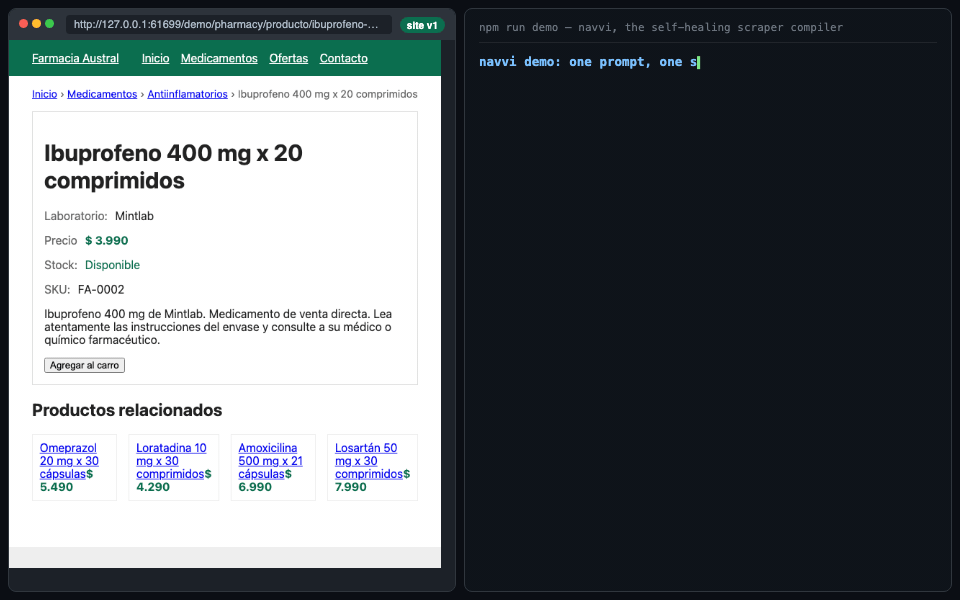

<p align="center">
  
</p>

<h1 align="center">Navvi</h1>

<p align="center"><strong>Turn a browser task into a scraper you can run again.</strong></p>

<p align="center">
  <a href="https://www.npmjs.com/package/navvi"></a>
  <a href="https://github.com/fellowship-dev/navvi/actions/workflows/ci.yml"></a>
  <a href="LICENSE"></a>
</p>

<p align="center"><a href="#see-it-work">Demo</a> · <a href="#install-and-run">Install</a> · <a href="#navvi-make-the-driver"><code>navvi make</code></a> · <a href="#choosers">Choose a model</a> · <a href="#development-and-tests">Contribute</a></p>

Navvi uses a model to choose among controls and fields found by code, then saves
a scraper with selectors, fingerprints and a navigation trace. Healthy repeat
runs reuse the prompt interpretation and scraper without model calls. When a
field or step changes, Navvi can ask the model for a targeted repair; some changes
still require a person or recompilation.

Jev supplies fast typed decisions. Navvi adds persistence, structured extraction,
replay and repair around those decisions. Jev also uses a text-capable fallback
for prompt interpretation and values to type; those calls are included in usage.

`navvi "<prompt>" <url...>` compiles and runs in one step; [`navvi
make`](#navvi-make-the-driver) is the same pipeline taken apart into eight
inspectable stages — spec, sample, investigate, reconcile, schema,
determinism, compile, verify — each writing its own artifact so you can read,
edit and re-run from any point in it. It is the way to run navvi against a
site you actually care about getting right.

## See it work

### 1. Compile: Haiku versus Jev

Same task, separate empty caches, Haiku on the left and Jev on the right.
The real-site comparison is pending owner review. Remote OK served unrelated
roles on its Python-filter page, so that attempt is not a valid speed comparison.
A Hacker News search comparison is being reviewed as an alternative.

### 2. Reuse: the saved scraper


[Watch the video](docs/remoteok-replay.mp4): ten records from a real Remote OK
search, then the same prompt in a fresh browser with **zero model calls**.
The two sequential runs are aligned, with original clocks (42.6 s / 3.7 s).
This historical capture demonstrates reuse, but its result relevance did not
pass the launch review. It is not an accepted Python-job search demo. Browser
execution still has a cost.

<details>
<summary>Recording evidence, healing demo and limitations</summary>

The controlled fixture below demonstrates compile, deliberately changed markup,
and replay. Its answers are recorded fixtures: it shows behavior, not live model
latency or a production-site guarantee. [Video](docs/demo.mp4), `npm run demo`.



The older [search-form comparison](docs/race.mp4) is a fixture recording, not
Remote OK. Current capture instructions and the two-run real-site recorder are in
[`docs/recording.md`](docs/recording.md). Failed recordings retain evidence and do
not export a success clip.

The historical [measurement table](docs/measurements.md) and
[Jev question-bank hillclimb](docs/jev-hillclimb.md) report a tuned scenario set.
Their cell counts are harness checks, not independent semantic accuracy. They do
not establish universal speedups, unseen-site accuracy or current prompt-to-output
costs. A new live demo must retain its own rows, timings and revision.

[Remote OK capture provenance](docs/remoteok-replay-provenance.json) ·
[Separate source verification](docs/remoteok-proof.json).

</details>

## Install and run

Node 22+. The published compiler is 3.0.0. The separate `--decider`/`--writer`
controls and highlighted-text extraction fix on main are newer than that release;
use the source installation below to reproduce the proposed Hacker News demo.

Install the published compiler with Chromium:

```bash
NAVVI_BROWSER=chromium npm install -g navvi@3.0.0
npx playwright@1.60.0 install chromium
navvi "Search Remote OK for Python jobs and extract up to 10 results with job title, company, location and job link. Exclude ads." https://remoteok.com/ --browser chromium --max-pages 1 --max-items 10 --out jobs.json
# Repeat the identical command to reuse the saved prompt interpretation and scraper.
```

For the default Camoufox browser, use `npm install -g navvi@3.0.0` without
`NAVVI_BROWSER`; postinstall downloads Camoufox. Version 3 replaces the earlier
2.x product with the scraper compiler.

To work from source:

```bash
git clone https://github.com/fellowship-dev/navvi.git
cd navvi
NAVVI_SKIP_BROWSER_DOWNLOAD=1 npm ci
npx playwright install chromium
npm run build
node dist/bin/cli.js --help
```

From source there is no `navvi` on your PATH: either run `npm link` once, or
read every `navvi ...` below as `node dist/bin/cli.js ...`. This install also
skips the Camoufox download, so pass `--browser chromium` — which every example
below does — or drop `NAVVI_SKIP_BROWSER_DOWNLOAD=1` and run
`npx camoufox-js fetch`.

Node 22+. Select a chooser below; an installed, signed-in Claude Code or Codex CLI
can answer on your subscription. Jev needs a TypeSafe or AI Gateway key plus a
text-capable fallback. A Gateway account must have access to the configured text
model as well as Jev; access to Jev alone does not cover prompt interpretation
or typed text. Browser time and subscription/API charges still apply.
Agents: read [`SKILL.md`](SKILL.md); [`llms.txt`](llms.txt) indexes the docs.

## What you get

- JSON or CSV records with a `_source` URL.
- A reusable scraper at `storage/key_value_stores/scraper-cache/<cacheKey>.json`.
  The rest of `storage/` can contain live browser sessions; keep it private.
- Cached prompt interpretation and healthy scraper replay with zero model calls.
  `--force-recompile` deliberately bypasses reuse.
- A targeted repair path plus explicit failure statuses when automation cannot finish.
- A stderr summary with pages, items, chooser usage and healing events.
- **Typed values when you ask for them**: `--fields name,price:money,stock:boolean`
  (or `type` on a field in the JSON input) coerces the extracted text after
  the fingerprint check: `money` and `number` read `$ 6.990` as `6990`,
  `12.990,50` as `12990.5` and `12 990` as `12990`, `integer` takes a whole
  number, `boolean` maps stock phrases in Spanish and English (`En stock`,
  `Agotado`, `Out of stock`, `Disponible: No`), `url` resolves to an absolute
  http(s) URL; a value that does not coerce is `null`. A bare `1.250` is 1250
  under `money` and `integer`, where a three-decimal reading is impossible, and
  `null` under `number`, where it is an ordinary weight and nothing in the text
  settles it. The type is recorded in the compiled scraper, so a replay coerces
  the same way with no model call. Untyped fields stay strings.
- **A URL list as the start**: `--from-url <url>` (or a
  `{ "requestsFromUrl": "<url>" }` entry in `startUrls`) fetches a URL that
  answers the pages to scrape as newline text or JSON (an array of URLs or of
  `{ url }` objects, or an object whose `urls`, `data` or `items` is one), so
  a backend endpoint can feed the daily target list directly.

## Before the compile: `navvi spec` and `navvi heuristics`

Two commands that read no page.

`navvi spec "<brief>"` turns a sentence into a **spec**: the site, what one row
is, what varies per run, the fields asked for — and, the part that earns it, the
things the brief did *not* say, as open questions with the brief quoted back.

```bash
navvi spec "I need the product info of a rotating set of products on a store site."
```

```
navvi: spec for a store site (product pages), one row per product
  inputs: unknown — "a rotating set of products"
  fields requested: none — the brief names no field
  fields inferred (the brief did not ask for these): product_name, sku, price, promo_price, stock
  open questions (2 blocking of 3):
    ! [fields-unnamed] Which fields should the scraper return?
        because the brief says "product info", which names no field; client answers
    ! [inputs-shape] In what shape do the inputs arrive: a URL list, a SKU or code list, or search terms?
        because the brief describes the inputs as "a rotating set of products", which fits all three
  not ready to investigate: answer the blocking questions and recompile the spec.
```

The spec is JSON on stdout (or `--out`), so a disagreement is settled by editing
an artifact and recompiling rather than by reading HTML. A model drafts it; the
brief then decides how much of that draft survives — a field the draft cannot
quote the brief for is recorded as inferred, never as requested. Pass the case's
own rules in with `--rubric "id=rule"` or `--rubrics-file`.

`navvi heuristics` lists the rules that decide **what the model is even asked**:
which tier to spend, which candidate to reject before a question is written, and
whether a bad run is drift or a site refusing you. Each carries the encounter
that produced it and is pinned by a fixture, so a rule that stops firing is a
failing test. `navvi heuristics <id>` shows one with the observation shape it
takes; `--json` gives the machine form.

## `navvi make`: the driver

The command above (and `navvi spec`) each do one thing. `navvi make` is the
whole pipeline as one command, staged so you can inspect and re-run any part
of it: **spec → sample → investigate → reconcile → schema → determinism →
compile → verify**, each stage writing its own artifact into a work directory
you name, plus a block on stderr saying what it read, what it wrote, and
whether it even ran.

`make` is on `main`, newer than the published `3.0.0`; build from source
(above) to get it — `node dist/bin/cli.js make --help` shows the same block
this section describes.

```bash
navvi make "Search Remote OK for Python jobs and extract up to 10 results with job title, company, location and job link. Exclude ads." \
  https://remoteok.com/ --browser chromium --work work/remoteok
```

A brief that names no field and no input shape stops at the first stage with
open questions and exit 3 — same as `navvi spec` above, because `spec` is the
first stage. Answer and continue with `--answer`:

```bash
navvi make --work work/remoteok \
  https://remoteok.com/ --browser chromium \
  --answer fields=title,company,location,link \
  --answer inputs=url_list
```

The URL is repeated on purpose: **URLs are positional and are not stored in the
work directory**, so a resume that omits them has nothing to sample and stops
at `sample`. Everything else on that first line is optional the second time.

`--work` is the one required *flag* and the one new idea: a directory, not a
file. Re-run the same command against it and only stages whose inputs moved
run again — the rest print `reused` and point at the artifact already on
disk. Everything else `make` needs is either on the command line the way
`navvi` already takes it (`<url...>`, `--from-url`, `--rubric`, `--decider`,
`--writer`, `--browser`, `--headed`, `--storage`) or new to `make` itself:

| flag | what it does |
| --- | --- |
| `--work <dir>` | Where the artifacts and the ledger live. Required. |
| `--answer <key=value>` | Answer an open question, by its id or by what it's about (`fields`, `inputs`, `target`, `entity`, `constraints.<name>`). Repeatable. |
| `--sample <n>` | How many URLs the compile sample spans. |
| `--replays <n>` | How many times the determinism stage reads each sampled URL (default 3, over up to 6 URLs). |
| `--offline` | Run only the stages that open nothing; the rest report why they were skipped. |
| `--force` | Re-run every stage, and overwrite an artifact edited by hand since navvi wrote it. |

`--work` and `--storage` are different directories for different things:
`--work` holds the pipeline's own artifacts, `--storage` (default
`./storage`) holds browser profiles and parked questions, same as the plain
`navvi` command.

### What lands in `--work`

| stage | artifact(s) |
| --- | --- |
| spec | `spec.json` |
| sample | `sample.json` |
| investigate | `investigation.json` |
| reconcile | `reconcile.json`, `reconcile.md` |
| schema | `schema.json` |
| determinism | `determinism.json` |
| compile | `scraper.json`, `rationale.md`, `machine.mmd` |
| verify | `scorecard.md` |

Plus `make.json`, the ledger: a SHA-256 over the exact bytes each stage read,
not the file's mtime — a `git checkout`, a `cp -r` or an editor that writes
through a temp file all move mtime without changing a byte. So editing an
artifact by hand and re-running is the supported way to correct a run: `make`
notices which bytes changed and recompiles only what actually reads them,
nothing upstream and nothing unaffected downstream. Re-running over an
edited artifact without `--force` stops and names the file instead of
overwriting your edit.

### Reading a result that isn't 100%

`verify`'s stage line reads `<N> of <M> compiled`, and `reconcile.md` names
which requested fields it could and couldn't get, and why. Fewer than
requested is an expected outcome, not a broken run: a field can fail to
survive the determinism stage (it moved between reads of an unchanged page,
so it's dropped rather than shipped as a guess) or simply never turn up in
what the page declares, fetches, or renders. On the one real site `make` has
been run against end to end so far, it binds 3 of 5 requested fields; the
other two are named, with the stage that couldn't reach them, in its own
`reconcile.md` and `scorecard.md` — that transparency is the point of staging
the pipeline in the first place. `make` does not yet handle every input
shape either: a spec whose `inputs.shape` is anything but `url_list` — a SKU
list, search terms — stops at the sample stage with a configuration error
rather than guessing at pages to read.

Two things worth knowing before you rely on `make` unattended: it has no
grade yet (`scorecard.md`'s numbers are the measurements a score would come
from — tier mix, fill rate, model calls at replay — the 100-point scorecard
itself is undecided), and its output shape (Markdown plus JSON artifacts in
a directory) is not the same as the plain `navvi` command's data-file output
above — the two are not drop-in replacements for each other yet.

## Choosers

Navvi never lets a model write a selector or a script. It enumerates the
candidates itself and asks a *chooser* to pick. A run picks two of them,
independently: the **decider** (`--decider`) answers the structured questions —
which of these candidates, yes or no, score this — and the **writer**
(`--writer`) answers the occasional free-text one, the search query to type
into a box. Five backends, one contract, and only Jev is limited to one role:

| name | Who answers | Needs | Decider | Writer |
| --- | --- | --- | :-: | :-: |
| `claude` | Claude Code (`claude -p`) on your subscription | `claude` installed and signed in | yes | yes |
| `codex` | Codex (`codex exec`) on your subscription | `codex` installed and signed in | yes | yes |
| `jev` | Jev by TypeSafe, through Vercel AI Gateway or direct | `AI_GATEWAY_API_KEY` or `TYPESAFE_API_KEY` | yes | no |
| `model` | Any AI SDK model | `ANTHROPIC_API_KEY`, or the Gateway | yes | yes |
| `agent` | The coding agent running the command, over stdio | Nothing | yes | yes |

Without `--decider` the order is: a key (`jev`, then `model`); else Claude
Code, then Codex, when installed and signed in (an installed CLI that is not
signed in never wins; the run says so and names `claude` or `codex login`);
else `agent`. The choice and its reason print on stderr unless `--quiet`.
`NAVVI_CLAUDE_MODEL` (default `haiku`) and `NAVVI_CODEX_MODEL` pick the CLI
model. CLI usage reports `$0.0000` with billing `subscription`; Claude Code's
own cost figure is kept as `reportedCostUsd` in the usage.

Without `--writer` the decider writes its own text — every backend but Jev
can. Jev answers choices, booleans and scores but cannot *write*, so its text
questions go to a second backend, and there the order is the other way round,
subscription before metering: `claude`, then `codex` when on PATH, and only
then a metered API key (`ANTHROPIC_API_KEY` first, since a dedicated key is a
deliberate choice, then `AI_GATEWAY_API_KEY`). So `AI_GATEWAY_API_KEY` routes
Jev's structured questions over Vercel, which is free for Jev, while the text
questions still prefer a signed-in CLI on your subscription; the Gateway text
model is used only when no CLI is installed. Sign-in cannot be checked without
running the CLI, so an installed but signed-out CLI is tried once, says so, and
the run moves to the next backend instead of failing. An explicit `--writer
model` (or `--chooser model`) always means the API model, whatever is installed.

`--decider-transport gateway|typesafe` says which API Jev is reached over.
Unset, it is inferred from the keys, the Gateway first when both are present;
`--decider-transport typesafe` forces the official TypeSafe API
(`api.typesafe.ai`) even with `AI_GATEWAY_API_KEY` in the environment, and
refuses the run rather than routing the other way when the matching key is
missing.

`--chooser` is the one flag those three replace, and it keeps working exactly
as before: it names the decider and leaves the writer derived. `--decider` and
`--writer` win over it, so `--chooser jev --decider claude` runs Claude Code.
The stderr summary reports the run under `chooser`, plus a `writer` line naming
the second source and its share of the tokens and cost when one answered the
text, so a run is attributable per role.

**A locally-run open-source model** is a designed seam, not a shipped backend.
Either role would take an OpenAI-compatible base URL plus a model id — the two
values llama.cpp, Ollama, vLLM and LM Studio all expose — as a `local` writer
and a third `--decider-transport`. Nothing accepts `local` today: it is
documented rather than enumerated, so no flag can select a backend that would
throw mid-run. The interface it must satisfy is `Chooser` in
`src/chooser/chooser.ts` (`name`, `ask(batch)`, `usage()`); the comment above
`textFallbackFor` in `src/chooser/index.ts` spells out the rest.

With the agent chooser, the CLI prints each question batch on stdout between
`---NAVVI-QUESTIONS---` and `---END---` and reads one JSON answer line from
stdin. When stdin cannot stay open, `--agent-mode file` parks the batch in
`storage/questions/<token>.json`, exits 3, and
`--answers answers.json --resume <token>` continues. Full protocol in
[`SKILL.md`](SKILL.md).

## How it differs

The reusable scraper is the product. A model-backed browser interaction produces
an artifact that code can execute again, with fingerprints and alternatives to
help detect and repair changes. This is useful for recurring extraction rather
than asking an agent to rediscover the same workflow every time.

The side-by-side recorder compares **Navvi + Jev with Navvi + Haiku** under the
same task. It does not measure Navvi against Jev Ultra Fast as a separate product.
A healthy replay recording also does not prove live healing; demonstrate drift
separately before making that claim.

## Local and Apify

Locally Navvi runs through the CLI: Camoufox by default, Chromium with
`--browser chromium`, profiles and compiled scrapers under `--storage`
(default `./storage`).

On Apify the same code is the actor under `.actor/`: the manifest, the input
schema (the CLI flags as fields, with section captions and descriptions
written for a model reading them through Apify's MCP server), the dataset
schema and two Dockerfiles. `Dockerfile` is the default build on
`apify/actor-node-playwright-chrome`; `Dockerfile.camoufox` builds on
`apify/actor-node-playwright-camoufox` and is the switch for a site that
challenges Chromium. Both image tags carry the Playwright version and must
equal the `playwright` pin in `package.json`; `node scripts/check-image-pins.mjs`
fails CI when they disagree. CI pushes every green `main` to the `beta` build
tag through `apify/push-actor-action` when the `APIFY_TOKEN` repository
secret is present; `latest` is a manual promote. `node scripts/push-beta.mjs`
pushes the Chromium beta from a signed-in CLI and `--camoufox` pushes the
Camoufox build under the `beta-camoufox` tag of the same version.

The actor input differs from the CLI in three places: `startUrls` takes
`{ url }` and `{ requestsFromUrl }` entries (Apify's request-list editor);
`profile` is `store` only, `chooser` and `decider` are `jev` or `model` and
`writer` is `model` (the image has no CLI to run on a subscription); a caller key
comes as a secret input (`typesafeApiKey`, `gatewayApiKey`,
`anthropicApiKey`) and is used for that run only. `scriptId` pins a compiled
scraper by key, with `scraperStore` naming the key-value store when the key
is bare (default `scraper-cache` in your account). Locally,

```sh
npx apify run --input-file input.json   # runs dist/src/main.js with local storage
```

runs the actor entry with the same input.

### Proxies and residential IPs

Yes: everything Apify Proxy offers is selectable in the Console's proxy editor
and reaches Crawlee. The `proxy` input is Apify's own proxy object, so the
groups and the country you pick survive validation and are handed to
`Actor.createProxyConfiguration`, which Crawlee then rotates per session for
every browser it launches.

```json
{
  "proxy": {
    "useApifyProxy": true,
    "apifyProxyGroups": ["RESIDENTIAL"],
    "apifyProxyCountry": "CL"
  }
}
```

In the Console: open **Proxy**, choose **Apify Proxy**, then select the
`RESIDENTIAL` group and, optionally, a country (two-letter code, e.g. `US`,
`CL`). Leaving the groups empty lets Apify pick datacenter proxies
automatically.

- **Residential costs money, by the gigabyte**, billed to your Apify account on
  top of the actor's events — datacenter proxies are the cheap default and are
  included in most plans. Turn residential on for the sites that need it, not
  for every run.
- **It is the fix for `blocked_bot_detection`.** A run that ends there is
  usually being blocked on the IP, not on the page: re-run it with
  `apifyProxyGroups: ["RESIDENTIAL"]`, and on a stubborn site with the Camoufox
  build as well.
- **Residential is not on every plan.** If your account has no access to the
  group you selected, the platform run stops before the browser opens with a
  configuration error that names the group and the country it asked for, so
  the fix is legible instead of a stream of 407s. Locally, where the Apify SDK
  only warns, the run says on stderr that no proxy was created and continues
  without one.
- **Your own proxies go in `proxyUrls`** instead, and are rotated the same way.
  Apify Proxy and your own proxies are one choice, not two layers: asking for
  both is refused at validation (Apify's own `ProxyConfiguration` also refuses
  to combine them) rather than one silently shadowing the other.

### Pay-per-event

On Apify the actor charges four events, priced in the Apify Console, never in
code. Every run ends with a `SUMMARY` record in the run's key-value store
carrying the status, counts, chooser usage, healing events, the `scriptId` to
pin next time, the charged event counts and the zero-data-retention state.

| Event | Charged |
| --- | --- |
| `actor-start` | Once, first thing; covers navigation model spend when the operator key is used |
| `scraper-compiled` | Once per template, the first time a page passes the fingerprint check with a scraper compiled this run; a cache hit charges nothing |
| `page-scraped` | Per scraped page (listing, paginated page, detail page); the limit is checked before every page |
| `result-item` | Per dataset item |

When the run's charge limit is reached the items pushed so far stay in the
dataset and the run ends `charge_limit`. Off the platform nothing is charged
and every count in the summary is zero; a local run with
`ACTOR_TEST_PAY_PER_EVENT=1 ACTOR_USE_CHARGING_LOG_DATASET=1` charges at $1
per event against `ACTOR_MAX_TOTAL_CHARGE_USD` and writes the charging log to
the `charging_log` dataset instead.

Who pays what under pay-per-event, per Apify's pricing docs: the caller pays
the events; the actor's platform usage (compute, residential proxy, storage)
is the operator's cost, which is why the event prices carry a compute margin.
The first platform run under this pricing confirms the split and this
paragraph is updated with the observed numbers.

## Exit codes

| Exit | Status | Meaning |
| --- | --- | --- |
| 0 | `succeeded` | Records written |
| 1 | `no_items_found`, `drift`, `blocked_bot_detection`, `blocked_login_required`, `blocked_no_progress` | The run stopped short; stderr says why |
| 2 | configuration or validation error | Bad flags, missing key (the message names `AI_GATEWAY_API_KEY` / `TYPESAFE_API_KEY` / `ANTHROPIC_API_KEY` and reminds you `--chooser agent` needs none), a CLI chooser that is not signed in (`claude`, `codex login`), a private host without `--allow-private-host` |
| 3 | `needs_human` | Questions parked in `storage/questions/<token>.json`; answer and `--resume` |
| 4 | `budget_exhausted`, `model_unavailable`, `charge_limit` | Retry later, raise the cap, or switch chooser |

`navvi make` uses the same numbers under its own names: `delivered` is 0,
`short` (a stage stopped, e.g. nothing obtainable) is 1, a bad flag or an
edited artifact `make` refuses to overwrite is 2, `needs_answers` (open
questions at the spec stage) is 3.

## Limits

- Models can mistake a filled form for a completed search. Validate the target
  results and output meaning, not just status or non-empty fields.
- Repairs supported field/step changes, but cannot guarantee repair of a redesign.
  An empty listing may report `no_items_found`; it is not always distinguishable
  from a changed item selector. Missing compiled rows get a bounded five-second wait.
- Extraction reflects the source. A selected search filter does not guarantee every
  returned job matches its meaning; verify relevance separately.
- No captcha solving. On a headed run (`--headed`) a challenge is handed to
  the person at the keyboard and their step is recorded; unattended runs
  report `blocked_bot_detection` — see
  [Proxies and residential IPs](#proxies-and-residential-ips) for the usual fix.
- Logins use `--profile local`. Secrets come from `NAVVI_SECRET_<NAME>`
  (`--secret name`), a `--secrets-file`, or a hidden TTY prompt; never the
  command line, never a question, a log or the scraper JSON.
- The run stays on the start URLs' domains unless `--allow-domain` widens
  it; private hosts need `--allow-private-host`; destructive-looking actions
  need `--allow-mutation`.
- Pagination and item caps default to 10 pages and 1000 items
  (`--max-pages`, `--max-items`).

## Measurements

With and without Jev on the same pages: questions, wait time, cost and heal
rate live in [`docs/measurements.md`](docs/measurements.md).

## Architecture

Three layers — entry, the stages of a run, and the vocabulary they share — with
a module-by-module diagram of every import between them in
[`docs/architecture.md`](docs/architecture.md). It is generated from the code
and `npm run check:architecture` fails CI when the two disagree, so it is the
diagram and not a drawing of one.

## Development and tests

```bash
npm run typecheck
npm test
npm run build
```

CI runs the same offline suite with Chromium and recorded model answers; it
needs no model key. Live model tests are separate: `npm run test:live`.
[Testing and CI explained](docs/testing.md) · [Recording guide](docs/recording.md).
Report a failing URL and a redacted summary in [an issue](https://github.com/fellowship-dev/navvi/issues).
Never include browser profiles, cookies or API keys.

## License

MIT.
