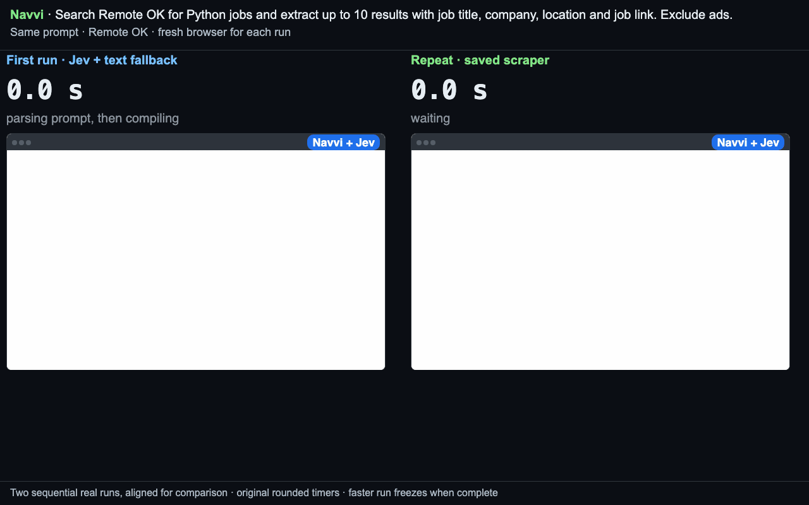

# Navvi

**Turn a browser task into a scraper you can run again.**

Navvi uses a model to choose among controls and fields found by code, then saves
a scraper with selectors, fingerprints and a navigation trace. Healthy repeat
runs reuse the prompt interpretation and scraper without model calls. When a
field or step changes, Navvi can ask the model for a targeted repair; some changes
still require a person or recompilation.

Jev supplies fast typed decisions. Navvi adds persistence, structured extraction,
replay and repair around those decisions. Jev also uses a text-capable fallback
for prompt interpretation and values to type; those calls are included in usage.

## Try the compiler from source

The compiler is version 3.0.0 in this checkout. As of 2026-09-20, npm's `navvi`
package is still 2.0.1 and represents the earlier product. Use the source revision
containing this README until the compiler release is published.

```bash
git clone https://github.com/fellowship-dev/navvi.git
cd navvi
# While the demo changes are in review:
git checkout fix/prompt-cache-demo-trial
NAVVI_SKIP_BROWSER_DOWNLOAD=1 npm ci
npx playwright install chromium
npm run build
node dist/bin/cli.js "Search Remote OK for Python jobs and extract up to 10 results with job title, company, location and job link. Exclude ads." https://remoteok.com/ --browser chromium --max-pages 1 --max-items 10 --out jobs.json
# Repeat the identical command to reuse the saved prompt interpretation and scraper.
```

Node 22+. Select a chooser below; an installed, signed-in Claude Code or Codex CLI
can answer on your subscription. Jev needs a TypeSafe or AI Gateway key plus a
text-capable fallback. Browser time and subscription/API charges still apply.
Agents: read [`SKILL.md`](SKILL.md); [`llms.txt`](llms.txt) indexes the docs.

## Demos and evidence



[Watch the 45-second clip](docs/remoteok-replay.mp4): two real sequential runs,
aligned for comparison with their original timers (42.6 s / 3.7 s). Both produce
ten records from the selected results page; replay makes zero model questions.
The clip demonstrates healthy reuse. It does not demonstrate healing or establish
a general speed ratio. [Capture provenance](docs/remoteok-replay-provenance.json)
and [separate final-revision source proof](docs/remoteok-proof.json) preserve the
evidence. The attempted Jev-versus-Haiku race was withheld because equivalent
search completion was inconsistent.

The controlled fixture below demonstrates compile, deliberately changed markup,
and replay. Its answers are recorded fixtures: it shows behavior, not live model
latency or a production-site guarantee. [Video](docs/demo.mp4), `npm run demo`.


The older [search-form comparison](docs/race.mp4) is a fixture recording, not
Remote OK. Current capture instructions and the two-run real-site recorder are in
[`docs/recording.md`](docs/recording.md). Failed recordings retain evidence and do
not export a success clip.

The historical [measurement table](docs/measurements.md) and
[Jev question-bank hillclimb](docs/jev-hillclimb.md) report a tuned scenario set.
Their cell counts are harness checks, not independent semantic accuracy. They do
not establish universal speedups, unseen-site accuracy or current prompt-to-output
costs. A new live demo must retain its own rows, timings and revision.

## What you get

- JSON or CSV records with a `_source` URL.
- A reusable scraper at `storage/key_value_stores/scraper-cache/<cacheKey>.json`.
  The rest of `storage/` can contain live browser sessions; keep it private.
- Cached prompt interpretation and healthy scraper replay with zero model calls.
  `--force-recompile` deliberately bypasses reuse.
- A targeted repair path plus explicit failure statuses when automation cannot finish.
- A stderr summary with pages, items, chooser usage and healing events.

## Choosers

Navvi never lets a model write a selector or a script. It enumerates the
candidates itself and asks a *chooser* to pick. Five choosers, one contract:

| `--chooser` | Who answers | Needs | Best for |
| --- | --- | --- | --- |
| `claude` | Claude Code (`claude -p`) on your subscription | `claude` installed and signed in | Out of the box, no key |
| `codex` | Codex (`codex exec`) on your subscription | `codex` installed and signed in | Out of the box, no key |
| `jev` | Jev by TypeSafe, through Vercel AI Gateway or direct | `AI_GATEWAY_API_KEY` or `TYPESAFE_API_KEY` | Speed, cost and unattended healing in cron or CI |
| `model` | Any AI SDK model | `ANTHROPIC_API_KEY` | A key you already have |
| `agent` | The coding agent running the command, over stdio | Nothing | Any tool that can keep stdin open or rerun with `--answers --resume` |

Without `--chooser` the order is: a key (`jev`, then `model`); else Claude
Code, then Codex, when installed and signed in (an installed CLI that is not
signed in never wins; the run says so and names `claude` or `codex login`);
else `agent`. The choice and its reason print on stderr unless `--quiet`.
`NAVVI_CLAUDE_MODEL` (default `haiku`) and `NAVVI_CODEX_MODEL` pick the CLI
model. CLI usage reports `$0.0000` with billing `subscription`; Claude Code's
own cost figure is kept as `reportedCostUsd` in the usage.

With the agent chooser, the CLI prints each question batch on stdout between
`---NAVVI-QUESTIONS---` and `---END---` and reads one JSON answer line from
stdin. When stdin cannot stay open, `--agent-mode file` parks the batch in
`storage/questions/<token>.json`, exits 3, and
`--answers answers.json --resume <token>` continues. Full protocol in
[`SKILL.md`](SKILL.md).

## How it differs

The reusable scraper is the product. A model-backed browser interaction produces
an artifact that code can execute again, with fingerprints and alternatives to
help detect and repair changes. This is useful for recurring extraction rather
than asking an agent to rediscover the same workflow every time.

The side-by-side recorder compares **Navvi + Jev with Navvi + Haiku** under the
same task. It does not measure Navvi against Jev Ultra Fast as a separate product.
A healthy replay recording also does not prove live healing; demonstrate drift
separately before making that claim.

## Local and Apify

Today Navvi runs locally through the CLI: Camoufox by default, Chromium with
`--browser chromium`, profiles and compiled scrapers under `--storage`
(default `./storage`). An Apify actor with the same input contract is
coming; the compiled scraper format is the same in both.

## Exit codes

| Exit | Status | Meaning |
| --- | --- | --- |
| 0 | `succeeded` | Records written |
| 1 | `no_items_found`, `drift`, `blocked_bot_detection`, `blocked_login_required`, `blocked_no_progress` | The run stopped short; stderr says why |
| 2 | configuration or validation error | Bad flags, missing key (the message names `AI_GATEWAY_API_KEY` / `TYPESAFE_API_KEY` / `ANTHROPIC_API_KEY` and reminds you `--chooser agent` needs none), a CLI chooser that is not signed in (`claude`, `codex login`), a private host without `--allow-private-host` |
| 3 | `needs_human` | Questions parked in `storage/questions/<token>.json`; answer and `--resume` |
| 4 | `budget_exhausted`, `model_unavailable`, `charge_limit` | Retry later, raise the cap, or switch chooser |

## Limits

- Models can mistake a filled form for a completed search. Validate the target
  results and output meaning, not just status or non-empty fields.
- Repairs supported field/step changes, but cannot guarantee repair of a redesign.
  An empty listing may report `no_items_found`; it is not always distinguishable
  from a changed item selector. Missing compiled rows get a bounded five-second wait.
- Extraction reflects the source. A selected search filter does not guarantee every
  returned job matches its meaning; verify relevance separately.
- No captcha solving. On a headed run (`--headed`) a challenge is handed to
  the person at the keyboard and their step is recorded; unattended runs
  report `blocked_bot_detection`.
- Logins use `--profile local`. Secrets come from `NAVVI_SECRET_<NAME>`
  (`--secret name`), a `--secrets-file`, or a hidden TTY prompt; never the
  command line, never a question, a log or the scraper JSON.
- The run stays on the start URLs' domains unless `--allow-domain` widens
  it; private hosts need `--allow-private-host`; destructive-looking actions
  need `--allow-mutation`.
- Pagination and item caps default to 10 pages and 1000 items
  (`--max-pages`, `--max-items`).

## Measurements

With and without Jev on the same pages: questions, wait time, cost and heal
rate live in [`docs/measurements.md`](docs/measurements.md).

## License

MIT.
