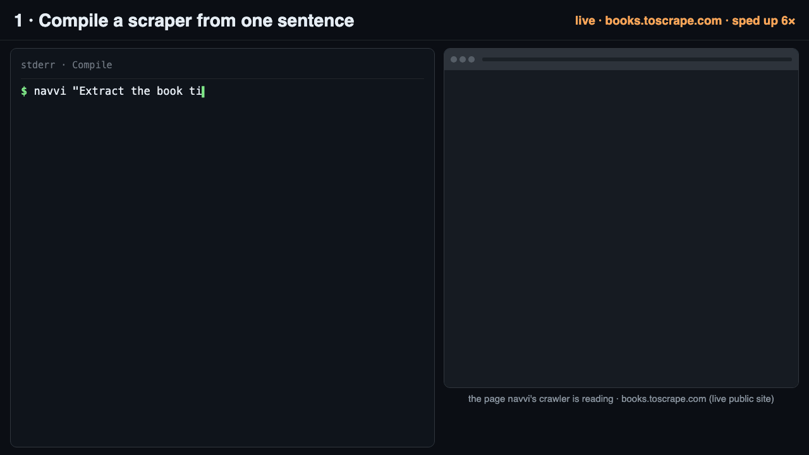
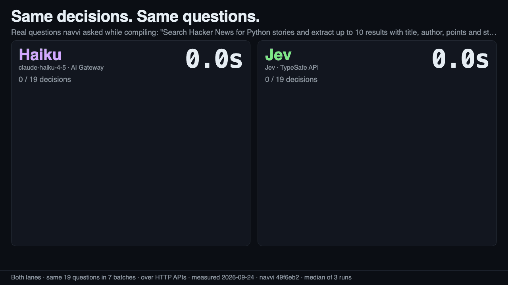
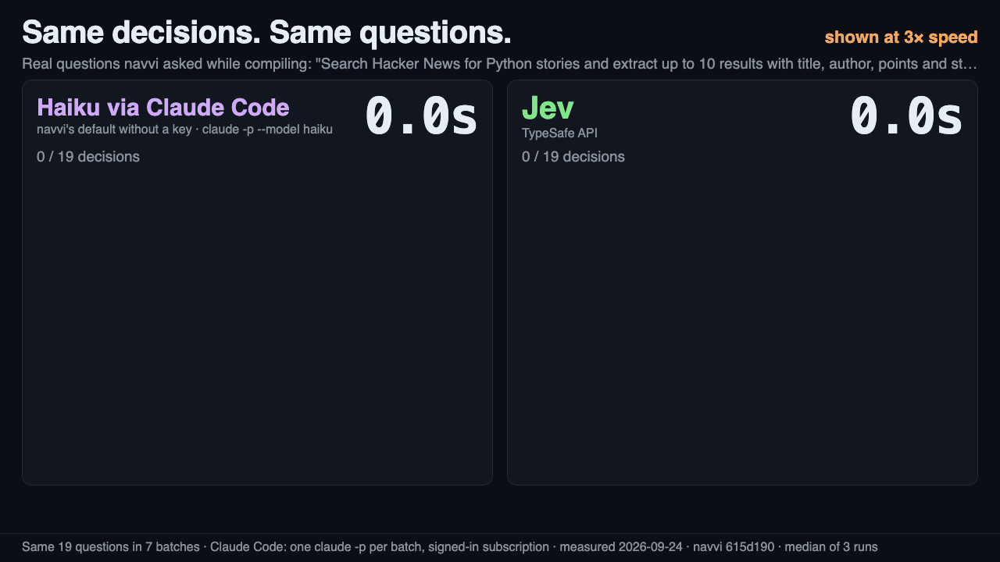
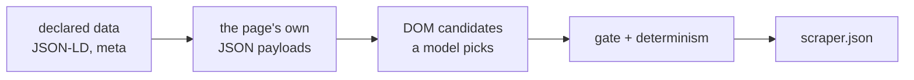

<p align="center">
  
</p>

<h1 align="center">Navvi</h1>

<p align="center"><strong>Give it to your agent. Get a scraper you can run forever.</strong></p>

<p align="center">
  <a href="https://www.npmjs.com/package/navvi"></a>
  <a href="https://github.com/fellowship-dev/navvi/actions/workflows/ci.yml"></a>
  <a href="LICENSE"></a>
</p>

<p align="center"><a href="#install">Install</a> · <a href="#why-use-jev">Why Jev</a> · <a href="#how-it-works">How it works</a> · <a href="#give-it-to-your-agent">For agents</a> · <a href="#choosers">Choosers</a></p>

- **Your agent asks in plain words.** `navvi "extract the title, price and availability" <url>`.
- **Navvi compiles a scraper, fast and accurately.** Code finds the candidates on the
  page; a model only *picks* among them. With [Jev](#why-use-jev) those picks are
  typed, cheap and [several times faster than Haiku](#why-use-jev).
- **Re-runs make zero LLM calls.** The compiled scraper is a JSON file of selectors
  and fingerprints. Run it in cron, in CI, on Apify.
- **It heals itself when the site changes.** A field that moved is found again and
  the scraper is updated; a redesign is reported, never guessed.



## Why use Jev

A scraper compiler makes a lot of small decisions: which element is the price,
which control to click next, is the search done. Navvi never asks a model to write
a selector or code; it enumerates the options and asks for a pick. That is exactly
the shape [Jev](https://typesafe.ai) is built for.



The same 19 questions navvi asked while compiling a Hacker News search, asked again
of each backend, one after another, median of three runs:

| Who decides | Time for 19 decisions | Jev is | Matched the reference |
| --- | --- | --- | --- |
| **Jev** (TypeSafe API) | **3.5 s** | — | 19/19 |
| Claude Haiku 4.5 over the API (AI Gateway) | 12.6 s | **3.6× faster** | 19/19 |
| Claude Haiku through Claude Code — navvi's default without a key | 31–38 s | **8–11× faster** | 19/19 |

Same answers, a fraction of the wait. The Claude Code row is already the fast
version: navvi now runs it without extended thinking, which took it from 91.6 s to
31–38 s with the same 19/19 (two sets of runs the same day; Claude Code's time varies).

 Method, every batch's
latency and the captured questions:
[`decisions-race-provenance.json`](docs/decisions-race-provenance.json) (the video, an earlier set of runs: 3.2 s against 11.0 s)
and [`decisions-race-claude-code.json`](docs/decisions-race-claude-code.json) (the
table). One task and one network location: a measurement, not a benchmark.

Turning it on is one environment variable. With `TYPESAFE_API_KEY` (or
`AI_GATEWAY_API_KEY`) set, navvi picks Jev by itself and says so:

```
chooser: jev (TYPESAFE_API_KEY found — fast typed decisions; text questions go to claude)
```

Jev picks; it does not write. The one or two free-text questions in a run (reading
your prompt, the words to type into a search box) go to a signed-in Claude Code or
Codex on your subscription, or to `ANTHROPIC_API_KEY`. Get a key at
[typesafe.ai](https://typesafe.ai).

## Install

Node 22+.

```bash
npm install -g navvi
npx playwright install chromium
navvi "Extract the book title, price and availability" \
  https://books.toscrape.com/catalogue/a-light-in-the-attic_1000/index.html --browser chromium --out books.json
```

Run the same command again, or point it at another page of the same kind
(`…/sharp-objects_997/index.html`): the saved scraper answers with zero model calls.

No key and no signed-in CLI? `--decider agent` makes your coding agent answer the
questions itself — see [Give it to your agent](#give-it-to-your-agent).

> Until 3.1.0 is on npm, `npm install -g navvi` gives 3.0.0, which predates the
> single compiler and `--work`. From source:
> `git clone https://github.com/fellowship-dev/navvi.git && cd navvi && NAVVI_SKIP_BROWSER_DOWNLOAD=1 npm ci && npx playwright install chromium && npm run build`, then `node dist/bin/cli.js …`.

## What you get

- **Records** on stdout or `--out data.json|data.csv`, one object per item with a `_source` URL.
- **A scraper you can commit**: `storage/key_value_stores/scraper-cache/<key>.json`.
  The rest of `storage/` holds browser profiles with live sessions; keep it private.
- **A summary on stderr** saying who answered what:

  ```
  navvi: status succeeded
    items 2  pages 2  templates 1  cache hit no
    decider jev: 3 decisions, 10115 input tokens, 7.3s waiting, $0.0004
    writer claude: 1 text question, 18709 input tokens, 7.7s waiting, $0.0000
  ```

- **Typed values when you ask**: `--fields name,price:money,stock:boolean` reads
  `$ 6.990` as `6990` and `Agotado` as `false`; a value that does not coerce is `null`.
- **A URL list as input**: `--from-url <url>` fetches the pages to scrape from an
  endpoint (newline text or JSON), so a backend can feed the daily list.

## How it works

One compiler, cheapest evidence first. For each kind of page (a URL template):



1. **Tier 1 — what the page declares.** JSON-LD and meta tags, read with one plain
   request. No browser, no model.
2. **Tier 2 — what the page fetches.** The JSON payloads the page loads for itself,
   bound only when a payload is provably about *this* page, and never two fields
   to one path.
3. **Tier 3 — the DOM.** Code enumerates candidate elements; the chooser picks one
   per field. Only the fields tiers 1–2 could not cover are asked.
4. **Close calls are questions, not guesses.** When two readings compete, the
   chooser is asked once, with your rules (`--rubric`) in the question, and the
   answer is recorded with who gave it.
5. **Replay makes no model calls.** Each field carries fingerprints; when one stops
   matching, only that field is re-decided and the scraper is updated.

### Audit a compile: `--work`

Add `--work <dir>` and the compile writes every step as a file you can read, edit
and re-run from — the spec, the sample, what each tier found, why each field was
bound (`rationale.md`), and a scorecard:

```bash
navvi "Extract the book title, price and availability" <url> <url> --work work/books
```

`navvi make "<brief>" <url...> --work <dir>` is the same pipeline as a resumable
driver: each stage re-runs only when the bytes it read changed, a hand-edited
artifact is never overwritten without `--force`, and open questions stop the run
with exit 3 until you `--answer` them. Both write the same `scraper.json` for a
record page.

## Give it to your agent

Copy [`SKILL.md`](SKILL.md) into your agent's skills (for Claude Code:
`.claude/skills/navvi/SKILL.md`). It tells the agent when to reach for navvi
instead of writing Playwright, the one command, how to answer questions itself
with no key (`--decider agent`, over stdio or with `--agent-mode file` and
`--resume`), and what each exit code means. [`llms.txt`](llms.txt) indexes the rest.

## Choosers

Navvi asks two kinds of question. The **decider** answers the picks (which
candidate, yes/no, a score); the **writer** answers free text.

| `--decider` | Who answers | Needs | Writes text |
| --- | --- | --- | :-: |
| `jev` | Jev by TypeSafe | `TYPESAFE_API_KEY` or `AI_GATEWAY_API_KEY` | no — hands text to the writer |
| `claude` | Claude Code on your subscription | `claude` installed and signed in | yes |
| `codex` | Codex on your subscription | `codex` installed and signed in | yes |
| `model` | Any AI SDK model | `ANTHROPIC_API_KEY`, or the Gateway | yes |
| `agent` | Your coding agent, over stdio | nothing | yes |

**Default order**: a Jev key → Jev; else `ANTHROPIC_API_KEY` → `model`; else a
signed-in Claude Code, then Codex; else `agent`. The choice and its reason print
on stderr.

**Jev's writer** is, in order: a signed-in `claude`, then `codex`, then a metered
key (`ANTHROPIC_API_KEY`, then the Gateway). A CLI that is signed out or times out
hands over to the next CLI; it never quietly starts spending on an API.
`--writer` pins it.

**Jev's transport**: with both keys set it goes over the Gateway and falls back to
the TypeSafe API if the Gateway is unavailable, saying so in the summary.
`--decider-transport gateway|typesafe` pins it and turns the fallback off.

`--chooser <name>` still works and means `--decider <name>`.
`NAVVI_CLAUDE_MODEL` (default `haiku`) and `NAVVI_CODEX_MODEL` pick the CLI model;
`NAVVI_CLI_TIMEOUT_MS` raises the CLI wait on a slow machine.

## Exit codes

| Exit | Status | What to do |
| --- | --- | --- |
| 0 | `succeeded` (`make`: `delivered`) | Use the data |
| 1 | `no_items_found`, `drift`, `blocked_*` (`make`: `short`) | Read stderr; a redesign needs a new prompt, a login needs `--profile local` |
| 1 | `partial` | Rows were written, but a requested field was never bound and is null on every row; the status line names it (`fields not found: …`). Rephrase the field or pass `--fields`, then `--force-recompile` |
| 2 | configuration error | Fix the flag; the message names what is missing |
| 3 | `needs_human` (`make`: `needs_answers`) | Answer the parked questions and `--resume`, or `--answer` |
| 4 | `budget_exhausted`, `model_unavailable`, `charge_limit` | Retry later, raise the cap, or switch chooser |

## Limits

- Heals a moved field or a renamed button; reports a redesign as `drift` rather
  than guessing.
- No captcha solving. `--headed` hands a challenge to the person at the keyboard.
- Logins use `--profile local`; secrets come from `NAVVI_SECRET_<NAME>`,
  `--secrets-file` or a TTY prompt — never the command line, a question, a log or
  the scraper JSON.
- The run stays on the start URLs' domains (`--allow-domain` widens it); private
  hosts need `--allow-private-host`; destructive-looking clicks need `--allow-mutation`.
- Defaults: 10 pages, 1000 items, or the limit the prompt states ("up to 10",
  "the first 3 pages"); `--max-pages` and `--max-items` win over both.
- Validate what you extract, not just that it is non-empty: a filled form is not
  always a finished search.

## More

- [Running on Apify](docs/apify.md) — the actor, residential proxies, pay-per-event.
- [`navvi spec` and `navvi heuristics`](SKILL.md#two-commands-that-read-no-page) — the
  brief as a spec with its open questions, and the rules that decide what a model is asked.
- [Architecture](docs/architecture.md) — every module and import, generated from the
  code and checked in CI.
- [Measurements](docs/measurements.md) · [Recording the demos](docs/recording.md) ·
  [Testing](docs/testing.md).

## Development

```bash
npm ci && npx playwright install chromium
npm run typecheck && npm test && npm run build
```

CI runs the offline suite with Chromium and recorded answers; it needs no key.
Report a failing URL with a redacted summary in
[an issue](https://github.com/fellowship-dev/navvi/issues) — never include browser
profiles, cookies or API keys.

## License

MIT.
