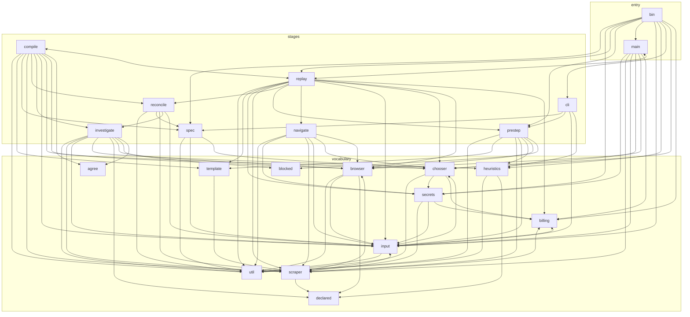

# Architecture: what `src/` is made of

Measured 2026-09-23 from the tree, not from memory: 20 directories under
`src/`, 21,356 lines, 97 cross-module imports. `scripts/check-architecture.mjs`
produced the diagram below and fails CI when the two stop agreeing. The counts
are a snapshot and the check does not assert them; the edges are the part it
keeps honest.

This lives in `docs/` and not in the README on purpose. The README is the
hottest file in the repo — 15 of the last 60 commits touched it — and a diagram
parked in a hot file is edited by every unrelated change until it is quietly
wrong. The check would catch that, but the point is not to have the argument
weekly.

## The graph

Three layers. An arrow may point sideways or down, never up. `<-->` is two
modules importing each other, which happens seven times and is the subject of
[The two knots](#the-two-knots).



The layers are declared in `LAYERS` in the check script, and the direction rule
is the assertion that does the work. A vocabulary module that acquires a
dependency on a stage has stopped being vocabulary; `util` importing `chooser`
is how a `src/` becomes a bag of cats, and it fails the build the day it is
written rather than the month someone notices.

## What each module owns

The test is whether a reader who has not opened the code can place a new file.

**entry**

| module | lines | owns |
| --- | --- | --- |
| `bin/cli.ts` | 581 | The `navvi` binary: argv in, process exit code out. Commands, the stdio and file question protocols, and nothing about how a page is read. |
| `src/main.ts` | 212 | One run as a function. Parses input, builds the chooser, calls the crawler, returns a `RunSummary`. The Apify actor entry point. |

**stages** — the phases of one run. A stage may use another stage and the whole
vocabulary.

| module | lines | owns |
| --- | --- | --- |
| `spec` | 543 | `navvi spec`: a plain-words brief becomes a `Rubric`, with what the brief left unsaid recorded as open questions. Reads no page. |
| `cli` | 531 | How a run is *shown*: argv parsing, output formats, the rendered spec and heuristic blocks, notifications. Not the binary — the binary is `bin/`. |
| `investigate` | 4447 | The discovery cascade: declared data, then captured JSON, then selectors, stopping as soon as the requested fields are covered, and writing down what it tried. See [`discovery.md`](discovery.md). |
| `reconcile` | 1094 | Phase D: the manuscript argued into `reconcile.md` — obtainable, not obtainable, **available but not requested**, ambiguities with the rubric that settled them quoted verbatim, obstacles with their cost — and `schema.json` derived from what was proved obtainable rather than from the brief. Deterministic, offline, and it opens nothing. |
| `compile` | 1867 | Turning a page into alternatives for a field — and, since U7a, turning a *reconciliation* into them without one. `compile.ts` is the expensive half: a live page, model calls, candidates, groups, chunked questions, links to follow. `proven.ts` is the model-free half: it reads what the investigation proved, emits the `json-ld` / `network` / `dom` cascade `replay` resolves, and renders `rationale.md`. `gate.ts` refuses a selector that will not survive a page it was not compiled from. |
| `replay` | 2759 | Running a compiled scraper again: crawl, extract, and heal the one field that moved. The only module that owns a crawler. |
| `navigate` | 992 | Getting from the start URL to the page that has the data — a goal-driven loop over controls the code enumerated. |
| `prestep` | 723 | What happens between the first navigation and the first charged question: credential refusal, consent banners, one Turnstile click, blocked classification. |

**vocabulary** — the nouns every stage shares. These must not know which stage
is running.

| module | lines | owns |
| --- | --- | --- |
| `input` | 633 | What the caller asked for: the parsed and validated run input, the field specs, the enumerations (choosers, browsers, profiles, modes) and `LIMITS`. |
| `scraper` | 1818 | The compiled scraper JSON — the versioned `CompiledScraper` contract, `Status`, extraction against it, and where it is stored. |
| `declared` | 207 | The one reader of a declared JSON block: JSON-LD, `@graph`, typed nodes, a path out of it. Written four times before it was a module. |
| `agree` | 217 | "Keep only what the samples agree on": the intersection over a set of samples, and the distinction between a sample that disagreed, a sample that could not answer, and a sample that was never asked. Also written four times before it was a module — see the 2026-09-22 defect in its header. |
| `browser` | 1203 | Playwright: launch, profiles, relaunch, navigation guards, typing, the injected snapshot and the network capture. The only module that says `chromium`. |
| `chooser` | 2407 | Asking an intelligence a question and trusting only the index that comes back. One interface over Jev, an API model, a signed-in CLI, the host agent and recorded answers. |
| `blocked` | 284 | The challenge lexicon: what "this site is refusing us" looks like, written once so the live check and the offline check cannot disagree. |
| `heuristics` | 804 | The named, overridable rules that decide what a model is even asked, each shipping with its fixture. |
| `template` | 222 | A **page template**: a host plus a URL pattern with the varying path segments blanked — `/producto/{slug}`, `/p/{id}`, `?page={page}`. Pages under one key share one set of alternatives, which is what makes a listing and its detail pages two things instead of two hundred. It surfaces as `RunSummary.templates`. It is not string interpolation. |
| `billing` | 183 | The budget and the pay-per-event charging: what a run is allowed to spend, what was charged, and the error raised when it runs out. |
| `secrets` | 178 | `{{secret:name}}`: where a value is resolved from, and the guarantee that every rendering path prints `[secret]`. |
| `util` | 32 | Text and value helpers with no imports. |

### Directories named for something other than a concept

Recorded, not renamed. A rename is a wide diff and none of these has bitten yet
— but a directory whose name does not say what it owns is where unrelated files
go to hide, so the next person to touch one should know it is on the list.

- **`util`** is named after a layer, not a concept. It holds 32 lines and imports
  nothing, which is the only reason it is harmless: the moment something is
  added because it is "shared" rather than because it is text handling, it will
  be the cat bag.
- **`input`** is a direction, not a thing. What it owns is *the request* — the
  parsed run input and its vocabulary. Its fan-in is 14, the highest in the
  repo, which is what a name that broad attracts.
- **`blocked`** is named after a `Status` value. What it owns is the challenge
  lexicon.
- **`prestep`** is named for *when* it runs, not what it knows. It happens to be
  a coherent set — the things that stand between arriving and reading — but the
  name will take anything that runs early.
- **`scraper`** is named after the product. Inside the product, everything is
  the scraper; what this directory actually owns is the compiled scraper *file
  format* and reading a page through it.

## The two knots

Seven pairs of modules import each other:

| pair | why it closes |
| --- | --- |
| `input <-> scraper` | `input/schema.ts` spells the field types `scraper/schema.ts` stores; `input/prompt.ts` wants `scraper/store.ts`'s `ActorLike`. |
| `chooser <-> input` | `input/schema.ts` names the chooser ids; `input/prompt.ts` asks a chooser a question. |
| `billing <-> input` | `billing/budget.ts` reads `LIMITS`; `input/prompt.ts` throws `NavviError`. |
| `billing <-> scraper` | `budget.ts` types itself with `Status`; `scraper/store.ts` throws `NavviError`. |
| `browser <-> scraper` | `browser/snapshot.ts` takes `Shape` as a type; `scraper/extract.ts` reads the network capture and the evaluate shim. |
| `compile <-> replay` | `replay/detail.ts` and `heal.ts` recompile a field; `compile/compile.ts` borrows `replay/entry.ts`'s scroll. |
| `main <-> replay` | `replay/crawler.ts` takes `RunSummary` as a type from the entry point. |

Counting pairs undercounts the damage, and the check does not count them. It
computes strongly connected components, which finds the longer loops too —
`chooser -> billing -> input -> chooser` is a cycle no pair shows — and those
seven pairs turn out to be **two knots**:

- **`billing, browser, chooser, input, scraper, secrets`** — six of the eleven
  vocabulary modules, all able to reach each other. Tied by `input/schema.ts`,
  which declares the run's vocabulary and then reaches back out to use it, and
  by `NavviError` living in `billing/budget.ts` where everything throws it.
- **`compile, main, replay`.**

`KNOWN_CYCLES` declares those two sets whole, with a reason each, and the check
fails when a *third* knot appears or when a module joins one of these — not on
an edge added inside a knot that is already tied. Inside a knot the individual
edge is not the problem; the knot is, and it is being unwound separately.

`replay -> main` is also the repo's only edge that points *up* a layer, listed
in `KNOWN_UPWARD`. It is type-only, so nothing points up at run time, but
`RunSummary` is a shape both the entry point and the crawler need and belongs
below both.

## No orphans

A directory under `src/` that nothing in `src/` or `bin/` imports is dead code
until someone says otherwise, so the check fails on one. `ORPHAN_ALLOWLIST` is
**empty**, and the last two entries came out on 2026-09-23.

An allowlisted orphan is not a tidiness problem. It is a module whose first
real caller has never compiled against it — which is how two halves of one
program stay green on separate fixtures until a live run introduces them, and
is the shape all four defects of 2026-09-22 had. Both entries here were exactly
that, and both were closed by writing the caller rather than by widening the
list.

- **`src/investigate/` (4,447 lines)** was the largest module in the repo with
  no importer anywhere but `scripts/live-investigate.ts`. `src/reconcile/` began
  reading its manuscript, and `src/compile/proven.ts` now reads it too — for
  `FieldRecord.rejected`, the candidates a tier considered and did not bind,
  which is the half of the rationale that says what a binding *beat*.
- **`src/reconcile/` (1,094 lines)** — Phase D: the argument (U4) and the schema
  it proves (U5) — was built against the manuscript ahead of its caller, with
  the same risk, and the entry said so. U7a is the caller:
  `src/compile/proven.ts` reads a `Reconciliation`, turns each
  `ObtainableField` into the `FieldAlternative`s `scraper/extract.ts` resolves,
  and asks `reconcile`'s own `rubricsFor` for the rules it quotes verbatim into
  `rationale.md`. That is the wiring into the compile path, not a second
  consumer of the artifact, and `tests/compile-proven.test.ts` runs the whole
  seam — manuscript, reconcile, compile, then the real cascade against a real
  page — rather than asserting the shape of the object in between.

What is still open is the **driver**: nothing yet runs `investigate`,
`reconcile` and `compileFromReconciliation` in sequence as one command. That is
U11, `navvi make`, and the plan lives in `fellowship-dev/claude-buddy` under
`specs/plans/2026-09-22-008-navvi-remaining-phases.md`. A missing driver is a
missing command, not a missing edge — the modules now compile against each
other, which is the property this section exists to protect.

**`tools/measure/`** is the other half of the older entry, and it is not an
orphan: it is a tool, not product — the measurement harness behind
`npm run measure` and `npm run hillclimb`, and the numbers in
[`measurements.md`](measurements.md). It moved out of `src/` on 2026-09-23
because it imported the entry point `src/main.ts` and the fixture server under
`tests/`, which is why `tsconfig.actor.json` had to carve it out of the actor
build by name. Out of `src/`, it is outside the graph the check walks and needs
no allowlist.

## The check

```
node scripts/check-architecture.mjs          # assert
node scripts/check-architecture.mjs --graph  # print the mermaid body above
npm run check:architecture
```

It runs in CI next to the image-pin check, before typecheck, because a diagram
that disagrees with the code should cost a second and not the browser suite.

It asserts four things:

1. **Every real edge is drawn and every drawn edge is real.** It walks
   `src/**/*.ts` and `bin/**/*.ts`, takes every relative `import`/`export
   … from` and dynamic `import()`, resolves it to a module, and compares that
   set with the mermaid fence above, failing in both directions. Type-only
   imports count: a type dependency is still a line in the file, and this
   diagram is about what the source knows, not what survives to run time.
2. **No edge goes up a layer**, except `KNOWN_UPWARD`.
3. **No new knot**, beyond `KNOWN_CYCLES`. Strongly connected components, so a
   three-module loop counts and a module joining an existing knot counts.
4. **No orphan**, beyond `ORPHAN_ALLOWLIST`.

A diagram is by construction a second spelling of the import graph, and
`tests/second-spelling.test.ts` states the house rule for those: where a second
spelling is unavoidable, a differential check over the real thing is mandatory,
not optional. That is what this script is. The diagram is also not hand-drawn —
`--graph` prints it, so the doc and the check agree by construction rather than
by diligence.

When the check finds a declaration that has gone stale — an allowlisted orphan
that now has importers, a knot that is untied, an upward edge that is gone — it
says so on stdout and still exits 0. Deleting the entry is the whole fix.
